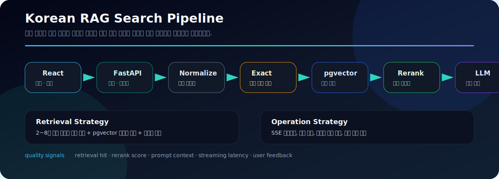

# Korean Knowledge Assistant

[](https://github.com/sunwoo8478/korean-chatbot/actions/workflows/ci.yml)


공공데이터 공통표준, 표준국어대사전, 업무 문서를 함께 검색해 근거 있는 답변을 만드는 한국어 RAG 어시스턴트입니다.  
벡터 검색 하나에만 기대지 않고 정확 검색, 도메인 보강, 리랭킹, SSE 스트리밍을 묶어 실제 업무 질문에 맞게 설계했습니다.



## 빠르게 보기

| 구분 | 내용 |
| --- | --- |
| 목표 | 한국어 데이터 표준화 질문에 대해 근거 있는 답변 제공 |
| 핵심 흐름 | exact search → vector search → rerank → context build → streaming answer |
| 백엔드 | FastAPI, PostgreSQL, pgvector, Pydantic Settings |
| 프런트엔드 | React 19, Vite, Tailwind CSS, Mermaid |
| 운영 | PM2, request log, admin API, runtime model setting |
| 문서 | [Architecture](./docs/ARCHITECTURE.md), [Operations](./docs/OPERATIONS.md), [Security](./SECURITY.md) |

## 프로젝트 목표

한국어 데이터 표준화 질문은 용어의 부분 일치, 동의어, 약어, 행정·공공 도메인 표현이 섞여 있어 일반적인 벡터 검색만으로는 정확한 근거를 찾기 어렵습니다. 이 프로젝트는 정확 검색과 벡터 검색을 함께 사용해 근거 문서를 좁히고, 리랭킹과 프롬프트 컨텍스트 조립을 통해 답변 품질을 높이는 것을 목표로 합니다.

| 목표 | 설명 |
| --- | --- |
| 근거 기반 답변 | 검색된 문서와 표준 용어를 바탕으로 답변 생성 |
| 한국어 검색 보강 | 2~8자 부분 문자열 정확 검색과 벡터 검색 결합 |
| 도메인 보강 | 검색된 문서 안의 도메인명을 다시 조회해 컨텍스트 확장 |
| 운영 가능성 | 런타임 모델 설정, 요청 로그, 피드백, 성능 관리 콘솔 제공 |
| 확장성 | 공공데이터, 사전, 사용자 업로드 문서를 함께 검색하는 구조 |

## 핵심 기능

- PostgreSQL/pgvector 기반 다중 소스 벡터 검색
- 질의 내 2~8자 부분 문자열을 이용한 표준 용어·단어 정확 검색
- exact result와 vector result를 결합한 리랭킹 파이프라인
- 검색 결과에서 도메인명을 재조회하는 컨텍스트 보강
- SSE 기반 실시간 답변 스트리밍
- 대화 이력, 북마크, 공유, 내보내기
- PDF·스프레드시트 등 사용자 문서 업로드 및 청크 검색
- 용어, 도메인, 프롬프트, 피드백, 성능을 관리하는 운영 콘솔

## 검색 파이프라인

| 단계 | 역할 |
| --- | --- |
| Query Normalize | 질문 정규화, 키워드 추출, 표준 용어 후보 구성 |
| Exact Search | 질의 내 부분 문자열을 이용한 표준 용어·단어 정확 검색 |
| Vector Search | pgvector 기반 문서 청크 유사도 검색 |
| Merge & Rerank | exact match와 vector result를 병합하고 재정렬 |
| Domain Enrich | 검색된 도메인명을 기준으로 상세 정보를 추가 조회 |
| Context Build | 답변에 사용할 근거 문서와 메타데이터 구성 |
| LLM Generate | OpenAI 호환 로컬 추론 서버 또는 외부 API로 답변 생성 |
| SSE Stream | 실시간 스트리밍 응답과 대화 이력 저장 |

## 엔지니어링 포인트

```txt
api          FastAPI / Uvicorn / Pydantic Settings
retrieval    PostgreSQL / pgvector / exact match / reranking
generation   OpenAI-compatible local LLM / Anthropic API option
frontend     React 19 / Vite / Tailwind CSS
operation    PM2 / request log / runtime model config / admin console
```

| 관심사 | 구현 방향 |
| --- | --- |
| 검색 품질 | 정확 검색과 벡터 검색을 분리한 뒤 리랭킹으로 합산 |
| 응답 UX | SSE 기반 스트리밍으로 답변 생성 중 대기감 완화 |
| 운영 관리 | 모델 설정, 프롬프트, 피드백, 성능 지표를 콘솔에서 관리 |
| 문서 처리 | PDF·스프레드시트 업로드 후 청크 단위 검색 가능 |
| 데이터 보호 | 원문 데이터, 사용자 문서, 운영 설정은 저장소에 포함하지 않음 |

## 기술 스택

| 구분 | 기술 |
| --- | --- |
| API | Python 3.11+, FastAPI, Uvicorn, Pydantic Settings |
| Retrieval | PostgreSQL, pgvector, 부분 문자열 정확 검색, 리랭킹 |
| LLM | OpenAI 호환 로컬 추론 서버, Anthropic API 선택 지원 |
| Frontend | React 19, Vite, Tailwind CSS, Mermaid |
| Operation | PM2, 요청 로그, 런타임 모델 설정, GitHub Actions |

## 프로젝트 구조

```text
app/
├── api/              # 채팅·문서·검색·인증·관리·내보내기 API
├── core/             # 환경 설정, DB 접근, 런타임 설정
├── rag/              # 임베딩, 검색, 리랭킹, 컨텍스트 조립
├── dynamic_tools/    # 런타임 도구 확장
└── static/           # 정적 배포 파일
frontend/
├── src/components/   # 화면 컴포넌트
├── src/hooks/        # 클라이언트 상태와 API 흐름
└── src/utils/        # 렌더링·마크다운·스트리밍 유틸
mcp/                  # MCP 연동 서버
docs/                 # 설계와 운영 문서
```

## 실행 방법

### 사전 요구사항

- Python 3.11+
- Node.js 22+
- PostgreSQL with `vector` extension
- Ollama embeddings API와 호환되는 임베딩 엔드포인트
- OpenAI-compatible LLM endpoint

### 환경 변수

```bash
cp .env.example .env
```

필요한 값만 로컬 환경에 맞게 수정합니다.

```dotenv
DB_HOST=localhost
DB_PORT=5435
DB_NAME=korean_dict
DB_USER=dictuser
DB_PASSWORD=change-me

VLLM_URL=http://localhost:8082/v1
VLLM_MODEL=your-model
OLLAMA_URL=http://localhost:11434/api/embeddings
EMBED_MODEL=bge-m3
RERANKER_URL=http://localhost:8100
```

### 백엔드

```bash
python -m venv .venv
source .venv/bin/activate
pip install -r requirements.txt
uvicorn app.main:app --reload --port 9000
```

### 프런트엔드

```bash
cd frontend
npm ci
npm run dev
```

Vite 개발 서버는 `/api` 요청을 `http://localhost:9000`으로 전달합니다.

## 검증

```bash
python -m compileall -q app
cd frontend
npm ci
npm run build
```

## 데이터와 보안

애플리케이션 코드는 공개하지만 사전 원문, 공공데이터 원본, 사용자 업로드 문서, 모델 가중치, 운영 환경 설정은 포함하지 않습니다.  
사용 권한이 있는 데이터만 처리하고 인증 정보는 환경 변수로 관리해야 합니다.

## 더 보기

- [아키텍처 문서](./docs/ARCHITECTURE.md)
- [운영 체크리스트](./docs/OPERATIONS.md)
- [기여 가이드](./CONTRIBUTING.md)
- [보안 안내](./SECURITY.md)
