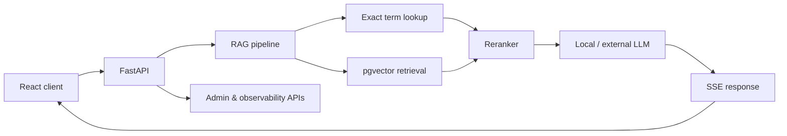

# Korean Knowledge Assistant

[](https://github.com/sunwoo8478/korean-chatbot/actions/workflows/ci.yml)


공공데이터 공통표준, 표준국어대사전, 업무 문서를 함께 검색해 근거 있는 답변을 생성하는 한국어 RAG 어시스턴트입니다. 단순 벡터 유사도에만 의존하지 않고 정확 일치 검색, 도메인 보강, 리랭킹을 결합해 데이터 표준화 질문에 강한 검색 흐름을 구성했습니다.

## Highlights

- PostgreSQL/pgvector 기반 다중 소스 벡터 검색
- 질의 내 2~8자 부분 문자열을 이용한 표준 용어·단어 정확 검색
- exact match와 vector result를 결합한 리랭킹 파이프라인
- SSE 기반 실시간 답변 스트리밍과 대화 이력 관리
- PDF·스프레드시트 등 사용자 문서 업로드 및 청크 검색
- 용어·도메인·프롬프트·피드백·성능을 관리하는 운영 콘솔
- 사용자 인증, 북마크, 공유, 내보내기 기능

## Architecture



## Tech stack

| Area | Technology |
| --- | --- |
| API | Python, FastAPI, Uvicorn, Pydantic Settings |
| Retrieval | PostgreSQL, pgvector, exact substring search, reranking |
| LLM integration | OpenAI-compatible local inference endpoint, Anthropic API option |
| Frontend | React 19, Vite, Tailwind CSS, Mermaid |
| Operations | PM2, request logging, runtime model configuration |

## Getting started

### 1. Prerequisites

- Python 3.11+
- Node.js 20+
- PostgreSQL with the `vector` extension
- An embedding endpoint compatible with Ollama's embeddings API
- An OpenAI-compatible LLM endpoint

### 2. Backend

```bash
python -m venv .venv
source .venv/bin/activate
pip install -r requirements.txt
```

Create `.env` in the repository root:

```dotenv
DB_HOST=localhost
DB_PORT=5435
DB_NAME=korean_dict
DB_USER=dictuser
DB_PASSWORD=change-me

VLLM_URL=http://localhost:8082/v1
VLLM_MODEL=your-model
OLLAMA_URL=http://localhost:11434/api/embeddings
EMBED_MODEL=bge-m3
```

```bash
uvicorn app.main:app --reload --port 9000
```

### 3. Frontend

```bash
cd frontend
npm ci
npm run dev
```

The Vite development server proxies `/api` requests to `http://localhost:9000`.

## Project structure

```text
app/
├── api/          # Chat, documents, search, auth, admin and export APIs
├── core/         # Settings, database access and runtime configuration
└── rag/          # Embedding, retrieval, reranking and context assembly
frontend/
├── src/components/
├── src/hooks/
└── src/utils/
mcp/              # MCP integration server
```

## Verification

```bash
python -m compileall -q app
cd frontend && npm run build
```

## Data note

The application code is public, but dictionary records, public-standard datasets, uploaded documents, model weights, and production configuration are not included. Use datasets you are licensed to process and keep credentials in environment variables.
