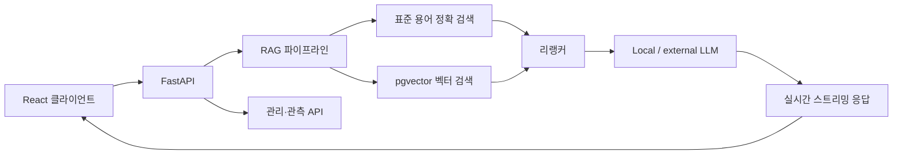

# Korean Knowledge Assistant

[](https://github.com/sunwoo8478/korean-chatbot/actions/workflows/ci.yml)


공공데이터 공통표준, 표준국어대사전, 업무 문서를 함께 검색해 근거 있는 답변을 생성하는 한국어 RAG 어시스턴트입니다. 단순 벡터 유사도에만 의존하지 않고 정확 일치 검색, 도메인 보강, 리랭킹을 결합해 데이터 표준화 질문에 강한 검색 흐름을 구성했습니다.

## 핵심 기능

- PostgreSQL/pgvector 기반 다중 소스 벡터 검색
- 질의 내 2~8자 부분 문자열을 이용한 표준 용어·단어 정확 검색
- exact match와 vector result를 결합한 리랭킹 파이프라인
- SSE 기반 실시간 답변 스트리밍과 대화 이력 관리
- PDF·스프레드시트 등 사용자 문서 업로드 및 청크 검색
- 용어·도메인·프롬프트·피드백·성능을 관리하는 운영 콘솔
- 사용자 인증, 북마크, 공유, 내보내기 기능

## 시스템 구성



## 기술 스택

| 구분 | 기술 |
| --- | --- |
| API | Python, FastAPI, Uvicorn, Pydantic Settings |
| 검색 | PostgreSQL, pgvector, 부분 문자열 정확 검색, 리랭킹 |
| LLM 연동 | OpenAI 호환 로컬 추론 서버, Anthropic API 선택 지원 |
| 프런트엔드 | React 19, Vite, Tailwind CSS, Mermaid |
| 운영 | PM2, 요청 로그, 런타임 모델 설정 |

## 실행 방법

### 1. 사전 요구사항

- Python 3.11+
- Node.js 20+
- PostgreSQL with the `vector` extension
- An embedding endpoint compatible with Ollama's embeddings API
- An OpenAI-compatible LLM endpoint

### 2. 백엔드

```bash
python -m venv .venv
source .venv/bin/activate
pip install -r requirements.txt
```

저장소 루트에 `.env` 파일을 생성합니다.

```dotenv
DB_HOST=localhost
DB_PORT=5435
DB_NAME=korean_dict
DB_USER=dictuser
DB_PASSWORD=change-me

VLLM_URL=http://localhost:8082/v1
VLLM_MODEL=your-model
OLLAMA_URL=http://localhost:11434/api/embeddings
EMBED_MODEL=bge-m3
```

```bash
uvicorn app.main:app --reload --port 9000
```

### 3. 프런트엔드

```bash
cd frontend
npm ci
npm run dev
```

Vite 개발 서버는 `/api` 요청을 `http://localhost:9000`으로 전달합니다.

## 프로젝트 구조

```text
app/
├── api/          # 채팅·문서·검색·인증·관리·내보내기 API
├── core/         # 환경 설정·DB 접근·런타임 설정
└── rag/          # 임베딩·검색·리랭킹·컨텍스트 조립
frontend/
├── src/components/
├── src/hooks/
└── src/utils/
mcp/              # MCP 연동 서버
```

## 검증

```bash
python -m compileall -q app
cd frontend && npm run build
```

## 데이터 안내

애플리케이션 코드는 공개하지만 사전 원문, 공통표준 데이터, 사용자 업로드 문서, 모델 가중치, 운영 환경 설정은 포함하지 않습니다. 사용 권한이 있는 데이터만 처리하고 인증 정보는 환경 변수로 관리해야 합니다.
