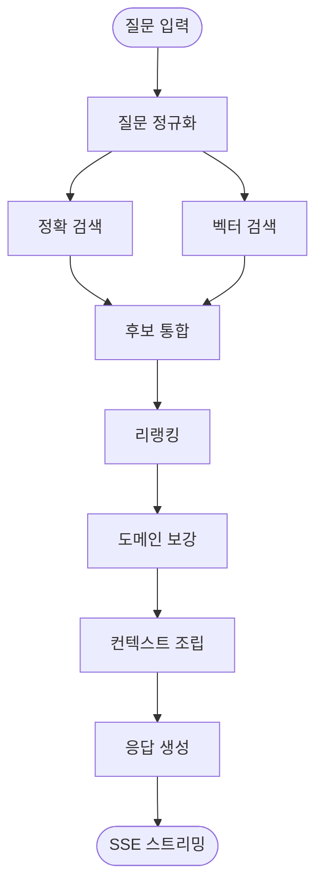

# Architecture

이 문서는 Korean Knowledge Assistant의 검색·생성 흐름을 설명합니다. 핵심은 일반 챗봇처럼 한 번에 답을 만들기보다, 업무 데이터에서 확인 가능한 근거를 먼저 모으고 그 위에서 답변을 생성하는 것입니다.

## 전체 흐름



## 검색 전략

| 단계 | 역할 |
| --- | --- |
| 정확 검색 | 질의에서 추출한 부분 문자열로 표준 용어, 단어, 도메인 후보를 찾습니다. |
| 벡터 검색 | 사용자의 표현이 DB의 표현과 다를 때 의미적으로 가까운 문서를 찾습니다. |
| 리랭킹 | 정확 검색과 벡터 검색 후보를 다시 정렬해 최종 컨텍스트 품질을 높입니다. |
| 도메인 보강 | 검색된 문서 안의 도메인명을 기준으로 도메인 상세 정보를 추가 조회합니다. |
| 컨텍스트 조립 | 최종 문서만 모델에 전달해 답변 범위를 좁힙니다. |

## 답변 원칙

공통표준과 사전 데이터처럼 정확성이 중요한 영역은 검색 결과를 우선합니다. DB에 없는 항목은 “정의되어 있지 않음”을 명시하고, 일반적인 설계 의견과 분리합니다.

```text
DB 기반 내용      검색 결과에서 확인된 값
DB 밖의 제안      일반적인 설계 관점이라는 점을 명시
일반 지식 질문    검색 컨텍스트가 맞지 않으면 모델 지식으로 답변
```

## 주요 모듈

| 파일 | 역할 |
| --- | --- |
| `app/api/chat.py` | 채팅 요청, 스트리밍 응답 처리 |
| `app/rag/retriever.py` | 정확 검색과 벡터 검색 후보 조회 |
| `app/rag/reranker.py` | 후보 문서 재정렬 |
| `app/rag/pipeline.py` | 검색, 보강, 컨텍스트 조립의 중심 흐름 |
| `app/core/runtime_config.py` | 런타임 모델 설정 |
| `app/core/database.py` | PostgreSQL 연결과 커서 관리 |

## 운영 관점에서 본 병목

| 병목 후보 | 확인 지표 |
| --- | --- |
| 임베딩 서버 | embedding latency, timeout count |
| 벡터 검색 | query duration, index usage |
| 리랭커 | rerank latency, candidate count |
| LLM 서버 | TTFT, tokens/sec, streaming interruption |
| DB 연결 | connection count, slow query |

## 데이터 경계

이 저장소는 애플리케이션 코드를 다룹니다. 실제 운영 데이터, 원문 문서, 인증 정보, 모델 가중치, 사용자 업로드 파일은 저장소에 포함하지 않습니다.
